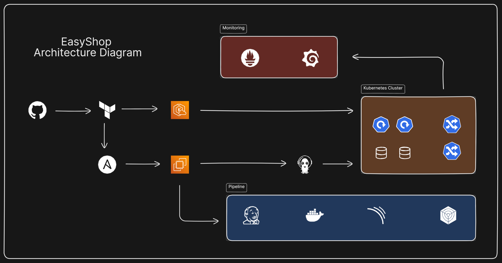
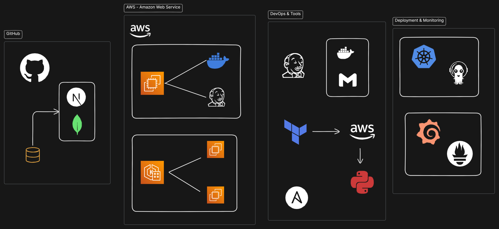

# 🛍️ EasyShop - Modern E-commerce Platform

[](https://nextjs.org/)
[](https://www.typescriptlang.org/)
[](https://www.mongodb.com/)
[](https://redux.js.org/)
[](LICENSE)

EasyShop is a modern, full-stack e-commerce platform built with Next.js 14, TypeScript, and MongoDB. It features a beautiful UI with Tailwind CSS, secure authentication, real-time cart updates, and a seamless shopping experience.

> Video: [Watch Video Demonstration](https://www.dropbox.com/scl/fi/55gz6m88z8s1cez9ojwvl/DevOps-Hackathon.mp4?rlkey=4xjw472r6p54p96cv5ne1c815&st=io7kvmv2&dl=0)

> 
> 

> Video: [Watch Video Demonstration](https://www.dropbox.com/scl/fi/55gz6m88z8s1cez9ojwvl/DevOps-Hackathon.mp4?rlkey=4xjw472r6p54p96cv5ne1c815&st=io7kvmv2&dl=0)

## ✨ Features

- 🎨 Modern and responsive UI with dark mode support
- 🔐 Secure JWT-based authentication
- 🛒 Real-time cart management with Redux
- 📱 Mobile-first design approach
- 🔍 Advanced product search and filtering
- 💳 Secure checkout process
- 📦 Multiple product categories
- 👤 User profiles and order history
- 🌙 Dark/Light theme support

## 🏗️ Architecture

> 
> 
> 

EasyShop follows a three-tier architecture pattern:

### 1. Presentation Tier (Frontend)
- Next.js React Components
- Redux for State Management
- Tailwind CSS for Styling
- Client-side Routing
- Responsive UI Components

### 2. Application Tier (Backend)
- Next.js API Routes
- Business Logic
- Authentication & Authorization
- Request Validation
- Error Handling
- Data Processing

### 3. Data Tier (Database)
- MongoDB Database
- Mongoose ODM
- Data Models
- CRUD Operations
- Data Validation

## PreRequisites

> [!IMPORTANT]  
> Before you begin setting up this project, make sure the following tools are installed and configured properly on your system:

## Setup & Initialization <br/>

### 1. Install Terraform

1. Terraform Installation
  ```bash
  curl -fsSL https://apt.releases.hashicorp.com/gpg | sudo apt-key add -
  sudo apt-add-repository "deb [arch=amd64] https://apt.releases.hashicorp.com $(lsb_release -cs) main"
  sudo apt-get update && sudo apt-get install terraform
  ```

2. Verify Installation
  ```bash
  terraform --version
  ```

### 2. Install AWS CLI
AWS CLI (Command Line Interface) allows you to interact with AWS services directly from the command line.

  ```bash
  curl "https://awscli.amazonaws.com/awscli-exe-linux-x86_64.zip" -o "awscliv2.zip"
  sudo apt install unzip
  unzip awscliv2.zip
  sudo ./aws/install
  ```

  ```aws configure```

This will prompt up to enter:
- **AWS Access Key ID:**<br/>
- **AWS Secret Access Key:**<br/>
- **Default region name:**<br/>
- **Default output format:**<br/>

> [!NOTE] 
>
> Save it because you will later need it
> 
> Make sure the IAM user you're using has the necessary permissions. You’ll need an AWS IAM Role with programmatic access enabled, along with the Access Key and Secret Key.

### 3. Install Ansible

  ```bash
  sudo apt update && sudo apt upgrade -y
  sudo apt install software-properties-common

  sudo add-apt-repository --yes --update ppa:ansible/ansible

  sudo apt install ansible -y

  ansible ---version
  ```

## Getting Started

**Repository Cloning**

```bash
git clone https://github.com/Abdullah-0-3/tws-e-commerce-app.git
```
> [!NOTE]
> If you want to headover to the Hackathon Repository check it out here [Hackathon Repository](https://github.com/LondheShubham153/tws-e-commerce-app/)

---

### Terraform Starter

1. Go to the Terraform Folder
```bash
cd terraform/
```

2. Generate Keys for Instances
```bash
mkdir keys
cd keys
ssh-keygen -t rsa -r 2048 -f bastion_key
```

3. Create Plan for Infrastructure as Code
```bash
terraform plan
```

4. Provisioning Cloud Infrastructure
```bash
terraform apply
```

> [!NOTE]
> A dialog box will apprear you may enter `yes` to provision your cloud resources.
>
> It may take up to 20 minutes to create bunch of Cloud Resources

---

### Ansible Configuration

1. Get on Ansible Directory
```bash
cd ansible
```

> [!CAUTION]
> Make sure you have installed `Python3` and installed the packages. If not then follow this
>
> ```bash
> sudo apt update -y
> sudo apt install python3
> ```
>
> Confirm the Installation
>
> ```bash
> python3 --version
> ```

2. Install Required Packages
```bash
pip install -r requirements.txt
```

3. Run the Python file
```bash
python3 main.py
```

- Cross Verification
```bash
cat inventory.ini
```
Check if this IP matches to your DevOps-Bastion Server in AWS

> [!NOTE]
>
> This Python file will connect to your AWS Account and fetch the Bastion Server IP Address which you created through Terraform along with Keys and Python Resources. 
>
> You may check the Python File for Labels and Region

4. Ansible Playbooks
```bash
ansible-playbook -i inventory.ini playbook.yml
```

> Watch the `Ansible Magic Steps`

It will install all the required packages and completly setup you Bastion Server.

> [!TIP]
>
> Watch the steps closely and you will see your Instance IP, Jenkins Initial Password, and much more...

---

### Bastion Server

Fetch your `DevOps-Bastion` Server IP Address from AWS Cloud Console and Copy it

- Get into your Server
```bash
ssh -i terraform/keys/bastion_key ubuntu@`IP ADDRESS`
```

In a few seconds you will be inside your server.

Once you are in it, read the instructions

```bash
cat welcome.txt
```

> [!TIP]
>
> You will now have all the Packages Installed and Jenkins Server Ready through Ansible

> [!CAUTION]
>
> Instance Prerequsites
>
> - Install AWS CLI
> - Publish AWS Credentials
> 
> ```bash
> aws configure
> ```

- Connect to EKS (Elastic Kubernetes Service)
```bash
aws eks update-kubeconfig --region us-east-2 --name easyshop-cluster
```

It depends on you cluster name and region

- Connection Check
```bash
kubectl get nodes
```

Hopefully, you will be ready for the EasyShop Application Deployment

---

### Jenkins CI/CD Piepline

- Access Jenkins
- Plugins
- Integreation
- Credentials
- Packages Setup
- Shared Library
- Running Jenkins Pipeline

> [!IMPORTANT] 
>
> You can check it here [**Jenkins CI/CD Pipeline**](/docs/jenkins.md)

---

### Pre-Deployment Steps

Applying:
- **Kubernetes Ingress Nginx**
- **Cert Manager Kubernetes**

> [!IMPORTANT] 
>
> You can check it here [**Pre-Deployment Steps**](/docs/pre-deployment.md)

### Continous Deployment - CD

- ArgoCD Setup
- Application Deployment

> [!IMPORTANT] 
>
> You can check it here [**Continous Deployment - CD**](/docs/deployment.md)

### Domain Mapping

1. Get the DNS Record from your LoadBalancer
```bash
kubectl get svc ingress-nginx-controller -n ingress-nginx -o jsonpath='{.status.loadBalancer.ingress[0].hostname}'
```

2. Add a CNAME Record in you Domain as `easyshop` and add the DNS Record you just got.

### HTTPS Check

- Check file to see whether you have Domain Mapped Correctly
* 00-cluster-issuer.yaml
* 04-configmap.yaml
* 10-ingress.yaml

- Check their Mapping and Change if needed.

### Monitoring

1. Add the Prometheus Helm repository
```bash
helm repo add prometheus-community https://prometheus-community.github.io/helm-charts
helm repo update
```

2. Install Prometheus and Grafana stack
```bash
helm install monitoring prometheus-community/kube-prometheus-stack -n monitoring --create-namespace
```

3. Port-forward to access Prometheus UI
```bash
kubectl port-forward svc/monitoring-kube-prometheus-prometheus 9090:9090 -n monitoring
```
Access at: http://IP-ADDRESS:9090

4. Port-forward to access Grafana UI
```bash
kubectl port-forward svc/monitoring-grafana 3000:80 -n monitoring
```
Access at: http://IP-ADDRESS:3000
- Default username: `admin`
- Default password: `prom-operator`

> [!TIP]
> Grafana comes with pre-configured dashboards for Kubernetes monitoring

## **Congratulations!** <br/>


### Your project is now deployed.
