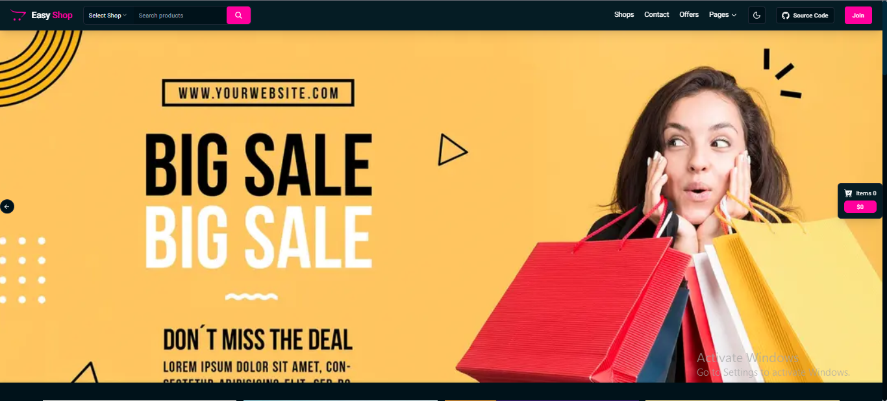
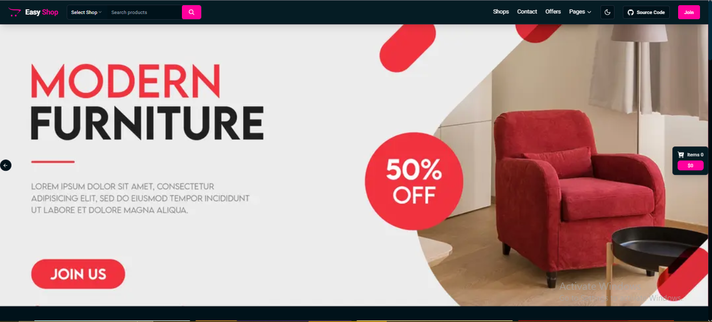

# 🛍️ EasyShop - Modern E-commerce Platform

EasyShop is a modern, full-stack e-commerce platform built with Next.js 14, TypeScript, and MongoDB. It features a beautiful UI with Tailwind CSS, secure authentication, real-time cart updates, and a seamless shopping experience.

> 
> 

## Contents

- [Features](#-features)
- [Architecture](#️-architecture)
- [Prerequisites](#prerequisites)
- [Getting Started](#getting-started)
- [CI/CD Pipeline](#cicd-pipeline)
- [Deployment](#deployment)
- [Monitoring](#monitoring)

## ✨ Features

- 🎨 Modern and responsive UI with dark mode support
- 🔐 Secure JWT-based authentication
- 🛒 Real-time cart management with Redux
- 📱 Mobile-first design approach
- 🔍 Advanced product search and filtering
- 💳 Secure checkout process
- 📦 Multiple product categories
- 👤 User profiles and order history
- 🌙 Dark/Light theme support

If you want more details headover to [**Features - EasyShop**](./docs/01-features.md)

## 🏗️ Architecture

Watch the full Architecture to understand the Application Workflow
[**Architecture Workflow**](./docs/02-about.md)

EasyShop follows a three-tier architecture pattern:

### 1. Presentation Tier (Frontend)
- Next.js React Components
- Redux for State Management
- Tailwind CSS for Styling
- Client-side Routing
- Responsive UI Components

### 2. Application Tier (Backend)
- Next.js API Routes
- Business Logic
- Authentication & Authorization
- Request Validation
- Error Handling
- Data Processing

### 3. Data Tier (Database)
- MongoDB Database
- Mongoose ODM
- Data Models
- CRUD Operations
- Data Validation

## PreRequisites

Install the Pre-Requsites

1. Terraform
2. AWS CLI

Installation Guide: [**Pre-Requisites**](./docs/03-pre-requisites.md)

## Getting Started

To get started with the EasyShop application setup and deployment, follow these guides:

1. [Setting up infrastructure](./docs/03-pre-requisites.md)
2. [Jenkins CI/CD setup](./docs/04-jenkins.md)
3. [Kubernetes deployment](./docs/05-deployment.md)

## CI/CD Pipeline

EasyShop uses a modern CI/CD pipeline for automated testing, building and deployment.

### Continuous Integration

- **Jenkins**: Automated build pipeline with quality checks
- For detailed setup instructions, follow our [Jenkins Setup Guide](./docs/04-jenkins.md)

### Continuous Deployment

- **ArgoCD**: GitOps-based Kubernetes deployment
- For detailed setup instructions, follow our [Deployment Guide](./docs/05-deployment.md)

### Pre Deployment Steps

- Setup Cert Manager
- Apply Ingress Nginx Controller

Detailed Steps, check [Pre-Deployment Procedures](./docs/06-pre-deployment.md)

## Deployment

The deployment process uses Kubernetes with ArgoCD for GitOps workflow:

- **Infrastructure**: AWS EKS
- **Deployment Tool**: ArgoCD
- **Ingress**: Nginx Ingress Controller
- **SSL/TLS**: cert-manager with Let's Encrypt

For detailed deployment instructions, see our [Deployment Guide](./docs/05-deployment.md).

## Monitoring

The EasyShop application is monitored using Prometheus and Grafana:

- **Prometheus**: For metrics collection and alerting
- **Grafana**: For visualization and dashboards

For detailed setup instructions, see our [Monitoring Guide](./docs/07-monitoring.md).

## **Congratulations!** 

### Your project is now deployed.
