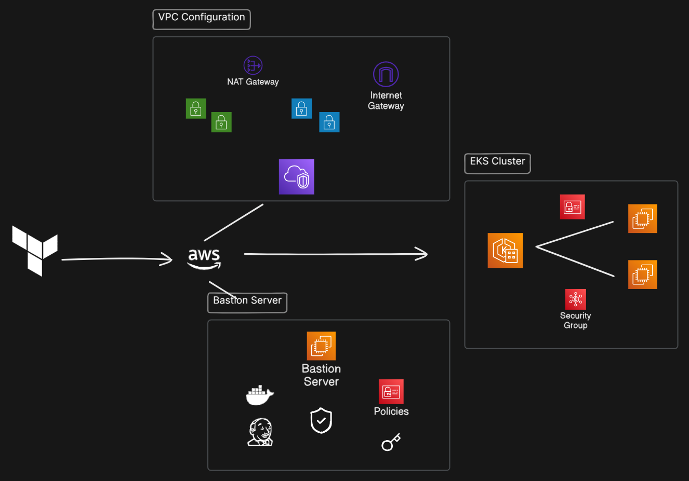

# EasyShop Terraform Infrastructure

This terraform configuration sets up a complete AWS infrastructure for the EasyShop application, including a VPC, EKS cluster, and a bastion host for secure access.

## Infrastructure Overview

<div style="text-align: center;">
  
</div>

This infrastructure solves several key challenges:

- **Network Isolation**: Separate public and private subnets keep sensitive workloads protected while allowing controlled external access
- **Security Layers**: Well-defined security groups restrict traffic flow between components
- **High Availability**: Resources spread across multiple availability zones prevent single points of failure
- **Scalability**: EKS managed node groups automatically scale up/down based on workload demands
- **Secure Access**: Bastion host acts as a secure entry point for cluster management

## What I did?

* Solved Error Warnings
* Used Modular Approach
* Pre-Configured Installation Script
* State Management
* Resuable Code & Outputs

## What's Included

- **VPC with Network**: Public subnets for load balancers and bastion, private subnets for EKS nodes
- **EKS Cluster**: Managed Kubernetes with optimized node groups and key add-ons pre-configured
- **Bastion Host**: Hardened jump server with minimal access surface with pre-defined installation script
- **Security Groups**: Fine-grained traffic control between infrastructure components
- **IAM Roles**: Least-privilege permissions assigned to each component

## Quick Start

1. Initialize Terraform:
   ```
   terraform init
   ```

2. Apply the configuration:
   ```
   terraform apply
   ```

3. Make sure you see the output properly!
4. Connect and Execute the Script

### Accessing the EKS Cluster

The infrastructure automatically grants cluster admin access to:
1. The IAM principal that created the cluster
2. The bastion host IAM role

To configure kubectl on your local machine:
```
aws eks update-kubeconfig --region <region> --name <cluster-name>
```

Or connect to the bastion host and run the same command there to manage the cluster.

If you face any issue regarding the terraform configuration `Create an Issue`. 
